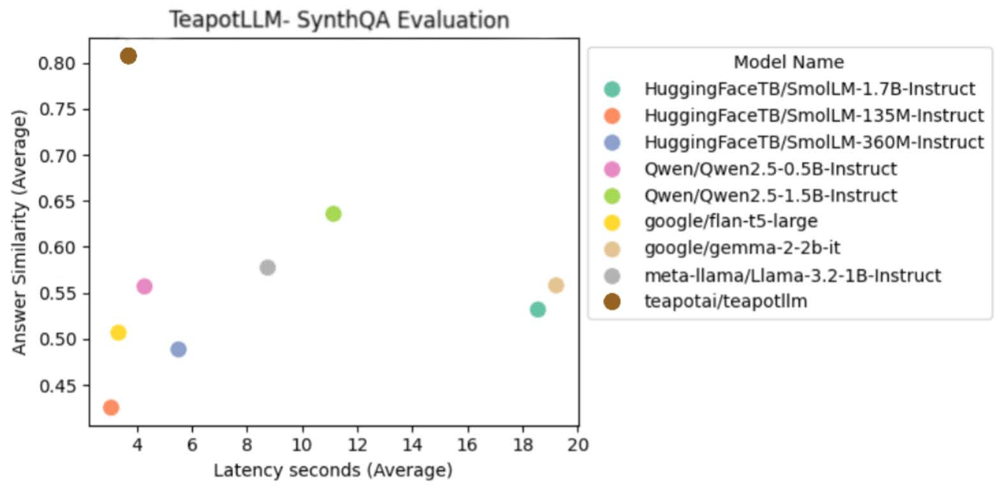
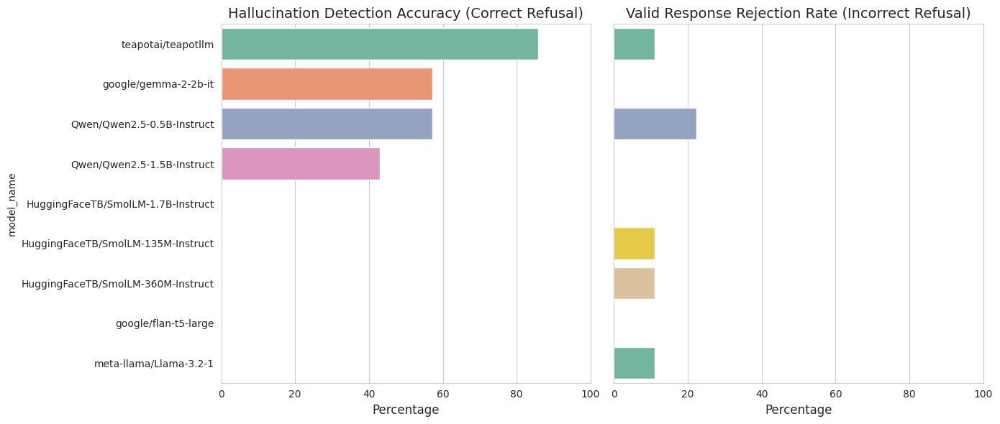

## Training Details

[Dataset] ~10mb synthetic dataset consisting of QnA pairs with a variety of task specific formats.
[Methodology] The model is trained to mimic task specific output formats, and is scored based on its ability to output relevant, succint and verifiable answers in the requested format.
[Hardware] Teapot was trained for ~10hr on an A100 provided by Google Colab.
[Hyperparameters] The model was trained with various learning rates and monitored to ensure task specific performance was learned without catastrophic forgetting.

Teapot is trained specifically for question answering use cases and is not intended to be used for code generation, creative writing or critical decision applications. Teapot has only been trained on specific languages supported by flan-t5 and has not been evaluated for performance in languages other than English.

